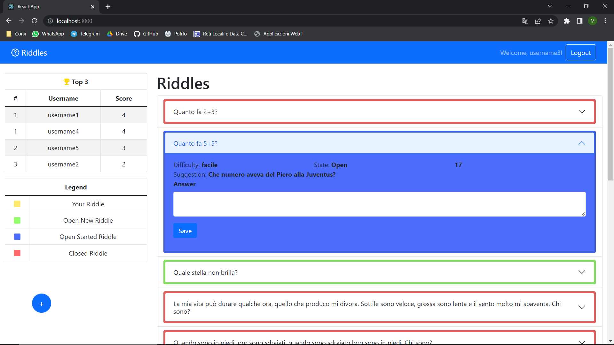

# Exam #12345: "Exam Title"
## Student: s295243 CADEDDU MANUEL 

## React Client Application Routes

- Route `/`: route verso la pagina principale o quella mostrata durante il caricamento dei dati dal DB
- Route `/add`: route verso la pagina che permette la creazione di un nuovo indovinello
- Route `/login`: route verso la pagina che permette di effettuare il login
- Route `/*`: (tutte le route da quelle sopra citate) route verso la pagina che indica che la pagina cercata è insesistente

## API Server

### User management

#### Login

* HTTP method: `POST`  URL: `/api/sessions`
* Description: autentica l'utente quando prova a loggarsi
* Request body: credenziali dell'utente che prova a loggarsi

``` JSON
{
    "username": "u1@p.it",
    "password": "password"
}
```

* Response: `200 OK` (successo)
* Response body: utente autenticato

``` JSON
{
    "id":1,
    "email":"u1@p.it",
    "username":"username1",
    "score":4
}
```
* Error responses:  `500 Internal Server Error` (generic error), `401 Unauthorized User` (login failed), `422 Email not valid'` (formato email errato)


#### Verifica se un utente e' loggato

* HTTP method: `GET`  URL: `/api/sessions/current`
* Description: verifica se l'utente e' autenticato e restituisce i suoi dati
* Request body: _None_
* Response: `200 OK` (success)

* Response body: utente autenticato

``` JSON
{
    "id":1,
    "email":"u1@p.it",
    "username":"username1",
    "score":4
}
```

* Error responses:  `500 Internal Server Error` (errore generico), `401 Unauthorized User` (utente non loggato)


#### Logout

* HTTP method: `DELETE`  URL: `/api/sessions/current`
* Description: logout current user
* Request body: _None_
* Response: `200 OK` (successo)

* Response body: _None_

* Error responses:  `500 Internal Server Error` (errore generico), `401 Unauthorized User` (utente non loggato)

#### Ottieni top3

* HTTP method: `GET`  URL: `/api/top3`
* Description: ottiene gli utenti con i 3 punteggi più alti
* Request body: _None_
* Response: `200 OK` (success)

* Response body: informazioni sugli utenti della top3

``` JSON
[
  {
    "username":"username1",
    "score":4,"rank":1
  },
  {
    "username":"username4",
    "score":4,"rank":1
  },
  ...
]
```

* Error responses:  `500 Internal Server Error` (errore generico)

### Riddle Management

#### Ottieni tutti gli indovinelli

* HTTP method: `GET`  URL: `/api/riddles`
* Description: fornisce tutti gli indovinelli prenti nel db. Se l'utente non ha il diritto di conoscere 'solution', 'suggestion1' e 'suggestion2' il campo verra' sostituito da una stringa vuota
* Request body: _None_
* Response: `200 OK` (success)
* Response body: Array di oggetti, ognuno descrive un indovinello:

``` json
[
  {
    "id":1,
    "text":"Quanto fa 2+3?",
    "solution":"5",
    "suggestion1":"Quanti sono i cerchi olimpici?",
    "suggestion2":"Quante dita in una mano?",
    "difficulty":"facile",
    "duration":30,
    "dateFirstAnswer":"2022-07-13T10:35:07.000Z",
    "open":0,
    "userId":"username1"
  },
  ...
]
```

* Error responses:  `500 Internal Server Error` (errore generico)

#### Aggiungi un nuovo indovinello

* HTTP method: `POST`  URL: `/api/riddles`
* Description: Aggiunge un nuovo indovinello
* Request body: descrizione dell'oggetto da inserire nel db

``` JSON
{
    "id": 2,
    "title": "21 Grams",
    "favorite": 1,
    "watchDate": "2022-03-17",
    "rating": 4,
    "user": 1,
    "difficulty": "facile",
    "duration": 30,
    "solution": "sol",
    "suggestion1": "sug1",
    "suggestion2": "sug2",
    "text": "riddle"
}
```

* Response: `200 OK` (successo)
* Response body: l'oggetto aggiunto nel db

* Error responses:  `422 Unprocessable Entity` (i valori non soddisfano il validatore), `503 Service Unavailable` (database error)

#### Chiudi un indovinello aperto

* HTTP method: `PUT`  URL: `/api/riddles/setClose/:id`
* Description: aggiorna un indovinello nel db, settando il campo 'open'=false
* Request body: id dell'indovinello da modificare

``` JSON
{
    "id": 1, 
    "open": 1, 
    "duration": 60, 
    "dateFirstAnswer": "2022-07-14T18:09:04.000Z"
}
```

* Response: `200 OK` (successo)
* Response body: l'oggetto aggiornato come e' nel db

* Error responses:  `422 Unprocessable Entity` (il valore non soddifa i valiatori o gli altri controlli), `503 Service Unavailable` (database error)

### Answer Management

#### Ottieni tutte le risposte

* HTTP method: `GET`  URL: `/api/answers`
* Description: fornisce tutte le risposte presenti nel db
* Request body: _None_
* Response: `200 OK` (success)
* Response body: Array di oggetti (vuoto se l'utente non è loggato), ognuno descrive una risposta:

``` json
[
  {
    "id": 1, 
    "text": "5", 
    "winning": 1, 
    "riddleId": 1, 
    "userId": "username5"
  },
  ...
]
```

* Error responses:  `500 Internal Server Error` (errore generico)

#### Aggiungi una nuova risposta

* HTTP method: `POST`  URL: `/api/answers`
* Description: Aggiunge una nuova risposta
* Request body: informazioni sull'oggetto da inserire nel db

``` JSON
{
    "text": "a", 
    "riddleId": 8
}
```

* Response: `200 OK` (successo)
* Response body: l'oggetto aggiunto nel db

* Error responses:  `422 Unprocessable Entity` (i valori non soddisfano il validatore o altri controlli), `503 Service Unavailable` (database error)


## Database Tables

- Table `riddles` - contains id (PRIMARY KEY), text, solution, suggestion1, suggestion2, difficulty, duration, dateFirstAnswer, open, userId(FOREIGN KEY("userId") REFERENCES "users"("username"))
- Table `answers` - contains id(PRIMARY KEY), text, winning, riddleId(FOREIGN KEY("riddleId") REFERENCES "riddles"("id")), userId(FOREIGN KEY("userId") REFERENCES "users"("username"))
- Table `users` - contains id(PRIMARY KEY), email(UNIQUE), username(UNIQUE), password, salt, score

## Main React Components

- `MyNavbar` (in `Navbar.js`): componente (navbar) che permette l'accesso alla pagina di login e di eseguire logout. Se l'utente è loggato ne mostra l'username.
- `MySidebar` (in `Sidebar.js`): componente (sidebar) che mostra la top3, la legenda per interpretare i colori della tabella degli indovinelli e il pulsante per creare un nuovo indovinello.
- `RiddlesTable` (in `RiddlesTable.js`): componente che contiene la tabella dove vengono mostrati gli indovinelli e le risposte; permette la visualizzazione di diverse informazioni che li riguardano e l'inserimento di nuove risposte.
- `LoginForm` (in `Auth.js`): componente (form) usato per eseguire il login dell'utente.
- `RiddleForm` (in `RiddleForm.js`): componente (form) che consente la creazione di un nuovo indovinello.

(only _main_ components, minor ones may be skipped)

## Screenshot



## Users Credentials
- u1@p.it, password
- u2@p.it, password
- u3@p.it, password
- u4@p.it, password
- u5@p.it, password
